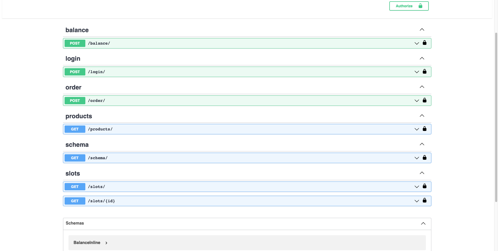

# Vending Machine

The course project involves creating a **backend system for a vending machine app**. The goal is to develop the core functionality and logic to enable users to interact with the vending machine and perform various actions. The backend system should integrate with a database to store and retrieve data related to products, users, transactions, and more.

The supported flows in the vending machine app include:

- Getting a list of products with prices.
- Topping up credit to the user's account.
- Ordering products from the available list.
- Closing the user's session to finalize any pending operations.
- Adding more products or increasing stock through an admin interface.

The project should prioritize error handling, validation mechanisms and authorization to ensure a smooth and secure user experience. The final implementation should be thoroughly tested, covering unit testing of individual components and integration testing of API endpoints and database interactions. The backend system is expected to integrate seamlessly with the corresponding frontend application.

## Solution - Swagger

